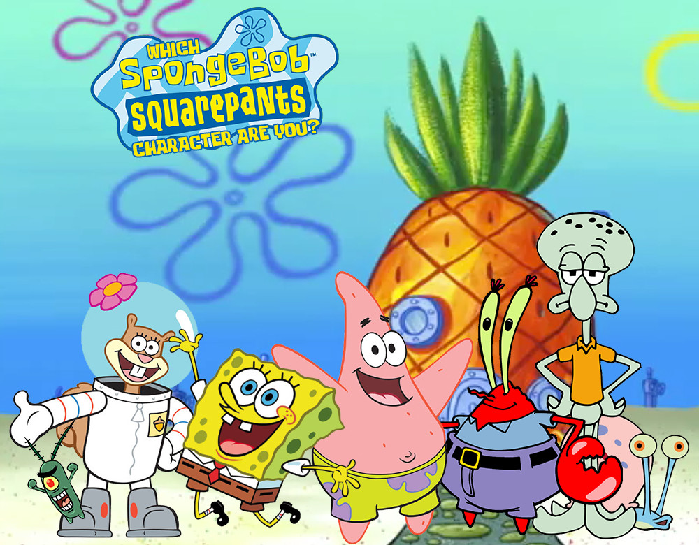

# NLP-SpongeBob
Corpus analysis using SpongeBob transcript to analyze each character.

* Reference Transcript: http://spongebob.wikia.com/wiki/List_of_transcripts

* Using [AntConc](http://www.laurenceanthony.net/software.html) in this project.

### crawling_code
	- ListCrawling.py: crawl the list of the files.
	- SampleTranscriptCrawling.py: crawl the sample transcript. (s1e1. Help_Wanted)
	- TranscriptCrawling.py: crawl the actual transcript.

### raw_data
	- raw transcripts

### raw_speaker
	- categrized into speakers.txt from raw_data

### antconc_keyword_result
	- keyword result from antconc
	- ~script.txt is the script file for each character for testing the score_app.
	- score_app.py: speaker recognizing program
	- score_app_tester.py: testing the score_app.py
	
### my_keyword_result
	- using keyness formula, I calculated keyword for Noun, Pronoun, Verb, Adverb, Adjective

### hypernym_approach
	- .net: network files
	- .txt-info.txt: information

### myapp
	- working server program ~ created with node.js server (nodejs.org)
	- npm install: install packages
	- npm start: for running the server